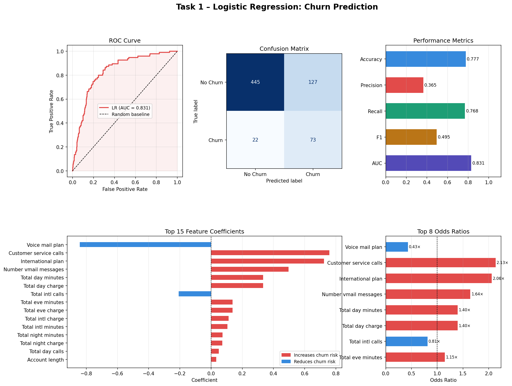

# Task 1 – Logistic Regression for Binary Classification

> Predicting customer churn using logistic regression on the BigML telecom dataset.

---

## Overview

This project implements a complete machine learning pipeline to predict whether a telecom customer will churn (leave the service), based on usage patterns and account features. It covers data preprocessing, model training, coefficient interpretation, odds ratio analysis, and full performance evaluation.

**Tools:** Python · pandas · scikit-learn · matplotlib · numpy

---

## Results

| Metric | Score |
|---|---|
| Accuracy | 77.7% |
| Recall | 76.8% |
| Precision | 36.5% |
| F1 Score | 49.5% |
| ROC-AUC | **0.830** |



---

## Key Findings

- **Customer service calls** (Odds Ratio 2.13×) — the strongest behavioural churn signal; repeated support contact indicates dissatisfaction.
- **International plan** (OR 2.06×) — subscribers on an international plan are twice as likely to churn.
- **Voice mail plan** (OR 0.43×) — the strongest protective factor; voicemail subscribers are 57% less likely to churn.
- High recall (76.8%) ensures most at-risk customers are flagged for retention intervention.

---

## Dataset

BigML Telecom Churn Dataset

| Split | File | Rows |
|---|---|---|
| Training | `churn-bigml-80.csv` | 2,666 |
| Test | `churn-bigml-20.csv` | 667 |

- **Target variable:** `Churn` (True / False)
- **Features:** 17 numeric and binary features (usage minutes, charges, plan subscriptions, service calls, etc.)
- **Class imbalance:** 85.4% no-churn · 14.6% churn → handled with `class_weight='balanced'`

---

## Project Structure

```
task1-churn-prediction/
├── README.md
├── requirements.txt
├── task1_logistic_regression_churn.py   # Full annotated pipeline
├── task1_logistic_regression_results.png
└── data/
    ├── churn-bigml-80.csv
    └── churn-bigml-20.csv
```

---

## How to Run

**1. Clone the repository**
```bash
git clone https://github.com/YOUR_USERNAME/task1-churn-prediction.git
cd task1-churn-prediction
```

**2. Install dependencies**
```bash
pip install -r requirements.txt
```

**3. Run the pipeline**
```bash
python task1_logistic_regression_churn.py
```

This will print evaluation metrics to the console and save `task1_logistic_regression_results.png`.

---

## Pipeline Steps

1. **Load data** — train/test CSVs loaded with pandas
2. **Preprocess** — label-encode categorical columns, cast target to int, drop irrelevant identifiers, apply `StandardScaler`
3. **Train** — `LogisticRegression(class_weight='balanced', max_iter=1000, solver='lbfgs')`
4. **Evaluate** — accuracy, precision, recall, F1, ROC-AUC, confusion matrix
5. **Interpret** — model coefficients and odds ratios for all 17 features
6. **Visualise** — 5-panel figure: ROC curve · confusion matrix · metric bars · coefficients · odds ratios

---

## Requirements

See `requirements.txt`. Python 3.8+ recommended.

---

## Author

**Department of Mathematics**  
Lagos State University of Science and Technology (LASUSTECH)  
B.Sc. Mathematics Programme
